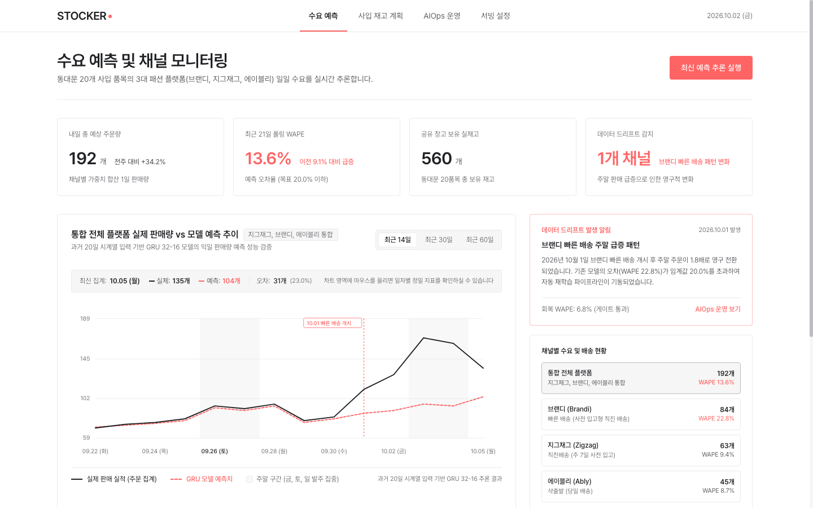
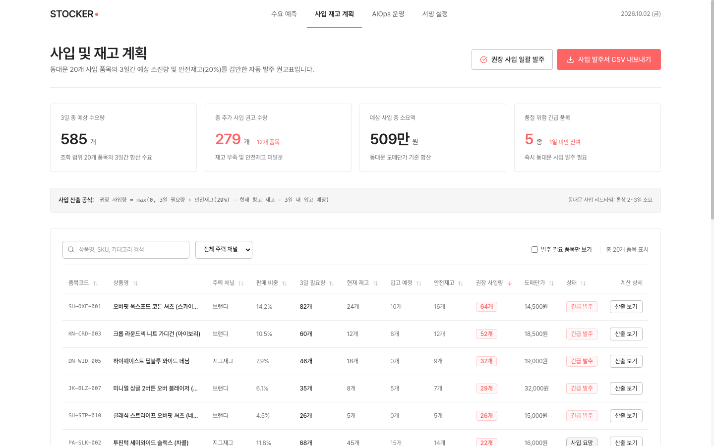
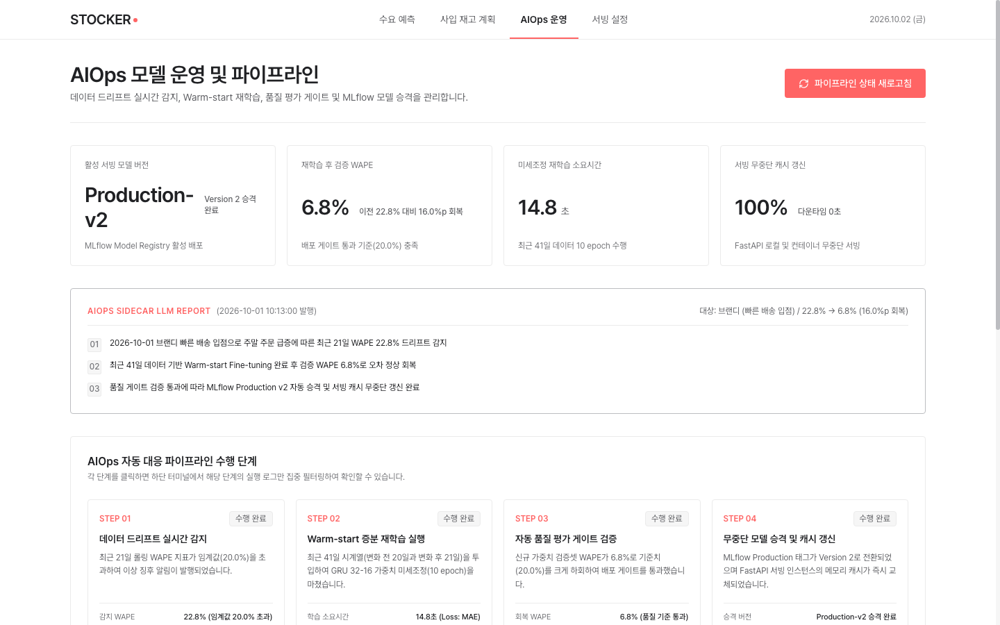
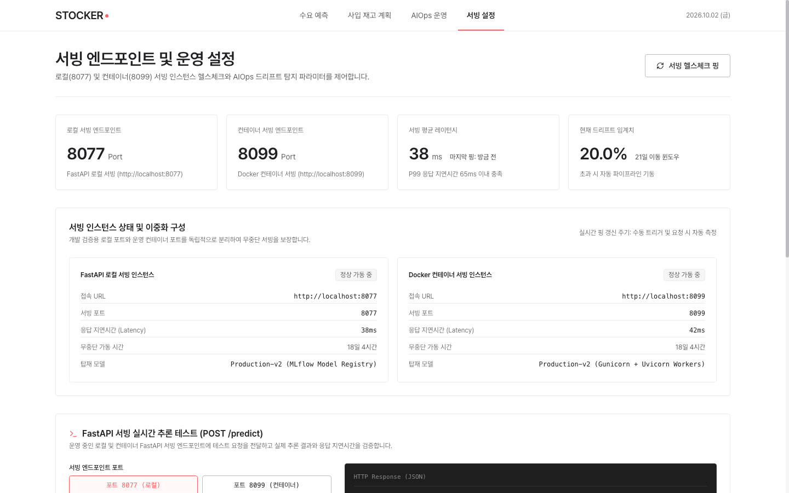

# STOCK-ER : AI기반 사입 쇼핑몰 판매량 관리 B2B서비스

동대문 사입 상품 20개를 **브랜디·지그재그·에이블리**에 판매하는 쇼핑몰의
**플랫폼별 다음 날 판매 수량**을 예측하고, 예측 오차가 커지면(드리프트) 자동으로
재학습·재배포하는 MLOps/AIOps 프로젝트입니다.

HAIC 모델 서빙 3일 실습 스켈레톤(Day1 서빙 → Day2 MLOps → Day3 AIOps)을 바탕으로,
데이터와 모델을 주가 예측에서 판매량 예측으로 바꿨습니다.

| 단계 | 내용 |
|---|---|
| Day1 서빙 | FastAPI로 모델 서빙, Lazy/Eager 로딩 비교, `/predict`·`/health` |
| Day2 MLOps | MLflow 학습 기록·Model Registry, 게이트 통과 시 Production 승격, Docker 단일 컨테이너 |
| Day3 AIOps | 플랫폼별 WAPE로 드리프트 감지 → warm start 재학습 → 자동 재배포 |



---

## 목차

1. [빠른 시작](#1-빠른-시작)
2. [디렉토리 구조](#2-디렉토리-구조)
3. [데이터](#3-데이터)
4. [모델과 피처](#4-모델과-피처)
5. [API](#5-api)
6. [AIOps 루프 : 드리프트 감지와 재학습](#6-aiops-루프--드리프트-감지와-재학습)
7. [대시보드 (React 프론트엔드)](#7-대시보드-react-프론트엔드)
8. [모델 구조 실험하기](#8-모델-구조-실험하기)

---

## 1. 빠른 시작

모든 명령은 **프로젝트 루트**에서 실행합니다. Python 3.12, TensorFlow 2.21 기준입니다.

```bash
# 0) 설치
source .venv/bin/activate          # 또는: python -m venv .venv && pip install -r requirements.txt
pip install -r requirements.txt

# 1) 합성 데이터 (data/synthetic/ 은 커밋되어 있으므로 생략 가능, seed 42로 재생성)
python scripts/generate_sales_data.py

# 2) 로컬 baseline 모델 + 스케일러 생성 (data/synthetic/sales_base.csv 사용)
python scripts/train_baseline_v1.py
#    -> serving_app/models/sales_v1.keras, serving_app/models/sales_scaler.pkl

# 3) 서빙 서버 기동 (Day1)
uvicorn serving_app.main:app --host 0.0.0.0 --port 8077
#    API 문서 : http://localhost:8077/docs
#    LOADING_MODE=eager 를 앞에 붙이면 시작 시점에 모델을 로드합니다 (기본 lazy)

# 4) 판매량 CSV 업로드 (학습·재학습은 항상 가장 최근 업로드 파일을 사용)
curl -F "file=@data/synthetic/sales_base.csv" http://localhost:8077/data/upload

# 5) MLflow 학습·등록 (Day2) - 게이트 통과 시 Sales_Predictor 를 Production 으로 승격
#    (첫 등록은 플랫폼별 WAPE ≤ 20%만, 이후에는 기존 Production보다 나쁘지 않아야 승격)
python serving_app/train_and_register.py

# 6) MLflow Production 모델로 서빙
MODEL_SOURCE=mlflow uvicorn serving_app.main:app --host 0.0.0.0 --port 8077
```

### Docker로 실행 (단일 컨테이너)

```bash
docker compose -f serving_app/docker-compose.yml up --build
# -> http://localhost:8099/ , http://localhost:8099/docs
```

이미지 빌드 중에 `sales_base.csv` 업로드 → baseline 학습 → MLflow 학습·등록이 모두 끝납니다.
MLflow도 컨테이너 안의 로컬 sqlite로 동작하므로 별도 서버가 필요 없습니다.
컨테이너는 `MODEL_SOURCE=mlflow`, `LOADING_MODE=eager`로 뜨며, 로컬 서버(8077)와 동시에 띄워 비교할 수 있습니다.

### 환경 변수

| 변수 | 값 | 설명 |
|---|---|---|
| `LOADING_MODE` | `lazy`(기본) / `eager` | 첫 요청 시 로드 / 서버 시작 시 로드 |
| `MODEL_SOURCE` | `local`(기본) / `mlflow` | `sales_v1.keras` / MLflow `Sales_Predictor` Production |
| `MLFLOW_TRACKING_URI` | - | `MODEL_SOURCE=mlflow`일 때 다른 트래킹 서버를 쓰려면 지정 |

---

## 2. 디렉토리 구조

```
project/
├── data/
│   ├── features.py               # 20일 × 11피처 전처리, SalesScaler (학습·서빙 공용)
│   ├── storage.py                # CSV 검증 로드, 최신 업로드 파일 조회 latest_upload()
│   ├── synthetic/                # 합성 판매량 CSV 5종 (커밋됨)
│   └── uploads/                  # /data/upload 로 올린 CSV (git 제외)
├── serving_app/
│   ├── main.py                   # FastAPI 앱, 라우터 등록, aiops 로거 설정
│   ├── schemas.py                # 요청·응답 스키마 (판매량 CSV와 같은 8개 필드)
│   ├── lstm_model.py             # 서빙 모델 구조 (GRU 32 → Dropout 0.2 → GRU 16, MAE)
│   ├── model_loader.py           # local / mlflow 로딩, Lazy·Eager, 캐시 무효화
│   ├── train_and_register.py     # train_and_register() 스크래치 학습 / fine_tune() warm start
│   ├── routers/                  # predict, health, data, logs
│   ├── monitoring/
│   │   ├── drift_detector.py     # 플랫폼별 WAPE·RMSE, 드리프트 판정
│   │   └── retrain_trigger.py    # 드리프트 시 fine-tuning → 게이트 → 재배포
│   ├── models/                   # 학습 산출물 (git 제외)
│   ├── static/index.html         # 확인용 대시보드 (8077 루트) : 업로드·시나리오 배치·로그
│   └── Dockerfile, docker-compose.yml
├── scripts/
│   ├── generate_sales_data.py    # 업무 규칙 기반 합성 데이터 생성
│   ├── train_baseline_v1.py      # 로컬 baseline 모델 + 스케일러 생성
│   ├── validate_sales_data.py    # 모델 구조 검증 (과적합·드리프트 판정·재학습 효과)
│   ├── run_experiments.py        # 모델 변형별 비교 실험 → JSON 한 줄 출력
│   ├── experiment_models.py      # 모델 구조 비교 실험 (초기 버전)
│   └── simulate_drift.py         # 시나리오 CSV를 /predict/batch-test로 보내는 드리프트 주입 클라이언트
├── mlops-frontend/               # React + Vite 운영 대시보드 (포트 3000)
├── docs/
│   ├── model-upgrade-gru-dropout.md   # GRU + Dropout 변경 근거
│   └── experiments/model-comparison.jsonl
├── screenshot/                   # 대시보드 화면 캡처
└── presentation/                 # 발표 자료용 이미지
```

---

## 3. 데이터

실제 데이터 없이 업무 규칙으로 만든 합성 데이터를 씁니다. 생성 규칙(요일 계수, 빠른 배송 효과·입점일,
상품 회전, 행사, 잡음)은 `scripts/generate_sales_data.py` 상단 상수에 모여 있습니다.

```
판매 수량 = 플랫폼 기본 판매량 × 요일 계수 × 계절 계수 × 상품 매력도 × 행사 배율 × 빠른 배송 효과 × 잡음
```

| 파일 (`data/synthetic/`) | 내용 | 용도 |
|---|---|---|
| `sales_base.csv` | 730일 × 3개 플랫폼 = 2,190행 (2024-10-01 ~ 2026-09-30) | 기본 학습 (앞 80% 학습 / 뒤 20% 검증) |
| `sales_normal.csv` | 기본 이력 + 정상 21일 | 정상 배치 → 드리프트가 **나오면 안 됨** |
| `sales_drift_brandi.csv` | 기본 이력 + 브랜디 빠른 배송 입점 21일 | 주 시나리오 → 브랜디가 **드리프트로 판정돼야 함** |
| `sales_drift_brandi_next.csv` | 위 시나리오 + 다음 21일 | 재학습 전/후 비교 (품절 수량) |
| `sales_drift_viral.csv` | 기본 이력 + 변동 폭이 커진 21일 | 보조 시나리오 → 재학습해도 게이트 미통과 |

**컬럼** : `Date, Platform, Sales_Qty, Orders, Fast_Delivery, Fast_Days, Active_SKU, Promo`

- `Platform`은 `brandi` / `zigzag` / `ably` 중 하나
- `Fast_Delivery`, `Promo`는 0 / 1, 나머지 수치는 0 이상의 정수, `Orders ≤ Sales_Qty`
- `(Date, Platform)` 중복 불가, 업로드 시 플랫폼마다 최소 41행(시퀀스 20 + 판정 21) 필요

시나리오 구간이 21일인 이유 : 드리프트 판정 배치가 41행이라, 업로드 파일의 최근 41행이
"변화 전 20일 + 변화 후 21일"이 되어 감지에 쓴 데이터와 재학습 데이터가 같아집니다.

---

## 4. 모델과 피처

입력 **(20일, 11개 피처)** → 출력 **다음 날 해당 플랫폼 판매 수량**. 세 플랫폼을 하나의 모델이 함께 학습합니다.

| # | 피처 | 형태 |
|---|---|---|
| 1 | 판매 수량 | log1p 후 [0, 1] 스케일 |
| 2 | 주문 건수 | log1p 후 [0, 1] 스케일 |
| 3 | 빠른 배송 여부 | 0 / 1 |
| 4 | 빠른 배송 경과일 | min(일수, 28) / 28 |
| 5–6 | 요일 | sin, cos |
| 7 | 판매 중 상품 수 | ÷ 20 |
| 8 | 행사 참여 여부 | 0 / 1 |
| 9–11 | 플랫폼 | 원-핫 (브랜디, 지그재그, 에이블리) |

`SalesScaler`는 baseline 학습 구간에서 **한 번만 fit**하고(`sales_scaler.pkl`), 이후 학습·재학습·서빙에서
그대로 재사용합니다. 다시 fit하면 이미 그 기준으로 학습된 가중치와 어긋나기 때문입니다.

### 모델 구조

```
Input(20, 11) → GRU(32) → Dropout(0.2) → GRU(16) → Dense(16, relu) → Dense(1)     loss MAE · 파라미터 7,009개
```

모델 구조 실험(이슈 #1)에서 채택한 기준 모델을 서빙에도 그대로 씁니다(근거 : [docs/model-upgrade-gru-dropout.md](docs/model-upgrade-gru-dropout.md)).

| 위치 | 용도 |
|---|---|
| `serving_app/lstm_model.py` | 서빙 모델 - baseline 학습, MLflow 학습, warm start 재학습이 공유 (파일 이름은 import 경로 때문에 유지) |
| `scripts/validate_sales_data.py` | 실험용 복사본 - 구조를 바꿔 비교할 때 이 파일의 `build_model()`만 고칩니다 |

loss는 평가 지표 WAPE(절대 오차 기반)와 맞춰 MAE를 씁니다. Dropout은 학습 때만 켜지고 추론 때는 꺼집니다.

---

## 5. API

| 메서드 | 경로 | 설명 |
|---|---|---|
| `GET` | `/health` | 상태, 모델 로드 여부, 로딩 모드 |
| `POST` | `/predict` | 한 플랫폼의 날짜순 20행 → 다음 날 판매 수량 |
| `POST` | `/predict/batch-test` | 플랫폼별 41행 이상 → 슬라이딩 예측 + 드리프트 판정 (+ 필요 시 재학습) |
| `POST` | `/data/upload` | 판매량 CSV 업로드 (검증 후 `data/uploads/`에 저장) |
| `GET` | `/data/status` | 최신 업로드 파일의 플랫폼별 기간·행 수 |
| `GET` | `/logs`, `/logs/{파일명}` | `logs/aiops.log` 목록·내용 |

`/predict` 요청 예시 (같은 플랫폼 20행, `Date` 오름차순):

```json
{
  "sequence": [
    {"Date": "2026-09-11", "Platform": "brandi", "Sales_Qty": 42, "Orders": 38,
     "Fast_Delivery": 0, "Fast_Days": 0, "Active_SKU": 17, "Promo": 0},
    "... 19행 더"
  ]
}
```

응답 : `{"platform", "prediction_date", "predicted_sales_qty", "model_version"}`

`/predict/batch-test` 호출 예시 (브랜디 드리프트 시나리오의 플랫폼별 최근 41행):

```bash
python - <<'EOF'
import json, pandas as pd, requests
df = pd.read_csv("data/synthetic/sales_drift_brandi.csv").sort_values("Date")
rows = json.loads(df.groupby("Platform").tail(41).to_json(orient="records"))
r = requests.post("http://localhost:8077/predict/batch-test", json={"rows": rows})
print(json.dumps(r.json()["drift_check"], indent=2, ensure_ascii=False))
EOF
```

정상 → 드리프트 시나리오를 한 번에 보내려면 `scripts/simulate_drift.py`를 씁니다 ([6번](#6-aiops-루프--드리프트-감지와-재학습) 참고).

---

## 6. AIOps 루프 : 드리프트 감지와 재학습

```
/predict/batch-test
   └─ 플랫폼별 최근 21건 WAPE 계산 (drift_detector.py)
        └─ 한 플랫폼이라도 WAPE > 20%  →  [WARN] drift detected
             └─ 최신 업로드 CSV의 플랫폼별 최근 41행으로 fine_tune()   →  [INFO] retrain triggered
                  └─ 게이트 : 모든 플랫폼 WAPE ≤ 20% 이고 기존 모델보다 나쁘지 않음
                       ├─ 통과 → Production 승격, (mlflow 모드) 서빙 모델 교체   →  [OK] new_wape=...
                       └─ 실패 → 기존 모델 유지                                   →  [GATE FAILED] ...
```

- **재학습은 처음부터 하지 않습니다.** 최근 데이터만으로 스크래치 학습하기엔 샘플이 적어,
  Production 가중치에서 이어서(warm start) **10 epoch, 학습률 1e-4**로 fine-tuning합니다.
  - `train_and_register()` : 스크래치 학습 (100 epoch, 학습률 1e-3)
  - `fine_tune()` : warm start 재학습
- RMSE는 보조 지표로 함께 기록합니다.
- 로그는 `logs/aiops.log`에 쌓이고 `/logs`로 확인할 수 있습니다.

### 시뮬레이션 실행

재학습은 **가장 최근 업로드 파일**의 플랫폼별 최근 41행을 쓰므로, 드리프트 시나리오 CSV를 먼저 올린 뒤 배치를 보냅니다.

```bash
# 서버 : MODEL_SOURCE=mlflow uvicorn serving_app.main:app --port 8077  (1번 빠른 시작 5단계까지 끝난 상태)
python scripts/simulate_drift.py --upload                  # sales_drift_brandi.csv 업로드 → 정상 배치 → 드리프트 배치
python scripts/simulate_drift.py --target both             # 로컬(8077)과 컨테이너(8099)에 같은 배치 전송
python scripts/simulate_drift.py --drift sales_drift_viral.csv   # 보조 시나리오
```

브라우저에서는 `http://localhost:8077/`(확인용 대시보드)에서 같은 시나리오 CSV를 골라 보낼 수 있습니다.

### 완료 기준

- [ ] `/data/upload`로 CSV를 올리면 `/data/status`에 반영되는가
- [ ] 정상 배치는 모든 플랫폼 WAPE 20% 이하, 브랜디 드리프트 배치는 **브랜디만** 20% 초과인가
- [ ] `logs/aiops.log`에 `[WARN] drift detected` → `[INFO] retrain triggered` → `[OK] new_wape=...` 또는 `[GATE FAILED]` 순서로 기록되는가
- [ ] 승격됐다면 `/predict` 응답의 `model_version`이 새 Production 버전이고, 게이트에서 탈락했다면 기존 버전이 그대로인가

게이트는 **플랫폼마다** "WAPE ≤ 20%"와 "기존 모델보다 나쁘지 않음"을 모두 요구합니다. 그래서 드리프트가 난 플랫폼은 크게 좋아져도
다른 플랫폼이 시험 구간(5일)에서 조금이라도 나빠지면 승격되지 않고 기존 모델이 유지됩니다(의도한 정책).
합성 데이터 브랜디 시나리오에서는 브랜디가 16.3% → 7.7%로 좋아졌지만 지그재그·에이블리가 소폭 나빠져 `[GATE FAILED]`가 납니다.

---

## 7. 대시보드 (React 프론트엔드)

`mlops-frontend/`는 서빙 API(8077, 컨테이너 8099)와 연동하는 운영 대시보드입니다.

```bash
cd mlops-frontend
pnpm install
pnpm dev        # http://localhost:3000
```

| 탭 (`?tab=`) | 내용 |
|---|---|
| `forecast` | 플랫폼별 수요 예측, 실시간 서빙 추론 |
| `inventory` | 예측 기반 재고·발주 계획 |
| `aiops` | 드리프트 감지 → 재학습 파이프라인, 모델 레지스트리·롤백 |
| `serving` | 서빙 인스턴스 상태, 추론 정책 |

| 재고 계획 | AIOps 파이프라인 | 서빙 상태 |
|---|---|---|
|  |  |  |

---

## 8. 모델 구조 실험하기

`serving_app/` 코드를 건드리지 않고, 검증 스크립트 하나로
**학습 → 과적합 점검 → 드리프트 판정 → 재학습 효과**를 한 번에 확인합니다.

```bash
python scripts/validate_sales_data.py        # CPU 기준 약 20초
```

### 기준 결과 (GRU + Dropout 0.2, seed 42)

| 항목 | 기준값 |
|---|---|
| 학습 / 검증 WAPE | 8.1% / 8.9% (차이 +0.7%p) |
| 비교 기준 : 7일 전 값 그대로 | 14.7% |
| 정상 구간 21일 WAPE 최대 | 14.8% |
| 정상 / 브랜디 드리프트 배치 (브랜디) | 9.0% / **24.5%** |
| 다음 21일 브랜디 품절 (재학습 전 → 10 epoch 재학습 후) | 274개 → 38개 |
| 총 소요 시간 | 약 18초 |

### 바꿔도 되는 것 / 바꾸면 안 되는 것

| 바꿔도 되는 것 | 위치 (`scripts/validate_sales_data.py`) |
|---|---|
| 층 구성 (LSTM·GRU·Conv1D 층 수·유닛 수, Dropout 등) | `build_model()` |
| loss, 학습률, optimizer | `build_model()`의 `compile` |
| batch size, 최대 epoch, EarlyStopping patience | `main()`의 `model.fit(...)` |
| 재학습 epoch·학습률 조합 | `main()`의 `for epochs, lr in [...]` |
| 피처 추가·삭제 | `feature_matrix()` (아래 주의 참고) |

재학습 단계는 `clone_model`로 같은 구조를 복제하므로 `build_model()`만 고치면 됩니다.
`recurrent_dropout`을 쓰면 학습 시간이 약 2배로 늘어납니다(0.2 기준 20초 → 45초).

**공정한 비교를 위해 고정하는 것**

- `SEED`, `TRAIN_RATIO`, `Scaler`(학습 구간에서 한 번만 fit)
- `WINDOW = 21`, `DRIFT_THRESHOLD = 0.20` - 서빙 앱의 판정 규칙과 같아야 합니다.
- `data/synthetic/` 데이터 - 생성 규칙을 바꾸려면 모델 실험과 따로 하고, 바꾼 상수를 기록하세요.

**주의 : 서빙 앱과 연결되는 값**

- `SEQ_LEN`(20)을 바꾸면 `/predict` 시퀀스 길이와 41행 판정 배치 구조가 함께 바뀝니다.
- 피처를 바꾸면 업로드 CSV 컬럼과 `/predict` 요청 필드가 바뀝니다.
- 두 경우 모두 반영 전에 팀과 먼저 상의하세요(노션 ⑤ API 명세에 영향).

### 출력 읽는 법과 통과 기준

| 출력 블록 | 확인할 것 | 통과 기준 |
|---|---|---|
| `[1] 기본 학습` | 학습 / 검증 WAPE와 차이 | 검증 WAPE < 14.7%(7일 전 값 기준), **학습-검증 차이 2%p 이하** |
| `[1]` 정상 구간 분포 | 정상 21일 WAPE 최대값 | **20% 미만** (넘으면 오탐) |
| `[2] 시나리오 배치 판정` | 플랫폼별 21건 WAPE | 정상 배치 : 전부 20% 이하 / 브랜디 드리프트 : **브랜디만** 20% 초과 |
| `[3]` | 빠른 배송 피처를 지웠을 때와의 차이 | 참고용 |
| `[4] 재학습` | 게이트 승격 여부, 다음 21일 WAPE·품절 | 승격되고, 품절이 재학습 전보다 줄어듦 |
| 마지막 줄 | 총 소요 시간 | **20분 이내** |

검증 WAPE만 낮다고 좋은 모델이 아닙니다. 너무 유연한 모델은 드리프트 구간에서도 입력을 빠르게 따라가
**브랜디 드리프트를 놓칠 수 있습니다**(`[2]`에서 20% 미만). 정확도와 드리프트 감지 가능성을 함께 보세요.

여러 변형을 같은 조건으로 비교하려면 `scripts/run_experiments.py`를 씁니다.

```bash
SEED=42 RETRAIN_GRID="10:1e-4,30:1e-3,20:3e-4" python scripts/run_experiments.py gru_drop
# variant : baseline | gru | gru_drop | gru_drop01x2
```

### 실험 기록


| 실험자 | 변경 내용 | 검증 WAPE | 학습-검증 차이 | 정상 구간 최대 | 브랜디 드리프트 | 재학습 후 품절 | 시간 |
|---|---|---|---|---|---|---|---|
| (이전 기준) | 스켈레톤 구조 + MAE | 9.0% | +0.8%p | 15.3% | 22.8% | 88개 | 20초 |
| 이승민 | GRU 32-16 + Dropout 0.1 | 8.6% | +0.2%p | 13.1% | 21.1% | 61개 | 15초 |
| 전우진 | 학습률 0.001(1e-3) → 0.0003(3e-4) | 10.1% | +1.7%p | 19.8% | 24.7% | 65개 | 34초 |
| 이진호 | LSTM 32 단층 + Dropout 0.2 | 8.8% | +1.0%p | 14.8% | 33.9% | 325개 | 12초 |
| 이진호 | LSTM 32 단층 (Dropout 없음) | 8.8% | +0.9%p | 16.8% | 23.0% | 71개 | 9초 |
| 정선우 | GRU 2층(32→16) | 8.7% | +0.9%p | 15.0% | 26.6% | 51개 | 21초 |
| 정선우 | GRU(32) → Dropout(0.2) → GRU(16) (3층→2층), **기준 모델로 채택** | 8.9% | +0.7%p | 14.8% | 24.5% | 38개 | 16초 |

---

